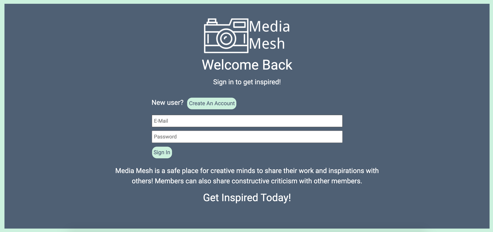

# Media-Mesh
A social media website designed to allow users to share and discuss their favorite forms of media. The inspiration behind this app was the quarantine of 2020. A lot of people were passionate about finding new talents to show off to the world and I wanted to build a safe place for those talents to be expressed to the world.



Check it out on heroku! https://media-mesh.herokuapp.com/

___

### Getting Started

To get this up and running locally, follow these commands below: 

1. To install the dependencies needed to run the server side appliction, run:
```
npm install
```
2. To install the dependencies on the client side, run:
```
cd client
npm install
```
3. Next, you must create your own .env file to import your own environmental variables to connect to a mySQL database.
```
cd ..
touch .env
```
4. From there, create environmental variables for the following variables:
```
DB_USER=username
DB_KEY=password
DB_HOST=localhost or whatever host
DB_NAME=database name
```
5. Next, go into your SQL editor of choice and create a database to be used with this application. Make sure the name matches the name provided in the .env file. 

6. After that is all finished, return to your terminal, and, in the root directory of the project, run:
```
npm start
```

___

### Built With
* **Front End:** React.js, CSS, Bootstrap, Axios
* **Back End:** Node.js, Express.js, BCrypt, Passport.js
* **Database:** mySQL, Sequelize
* **Image Storage:** Cloudinary
